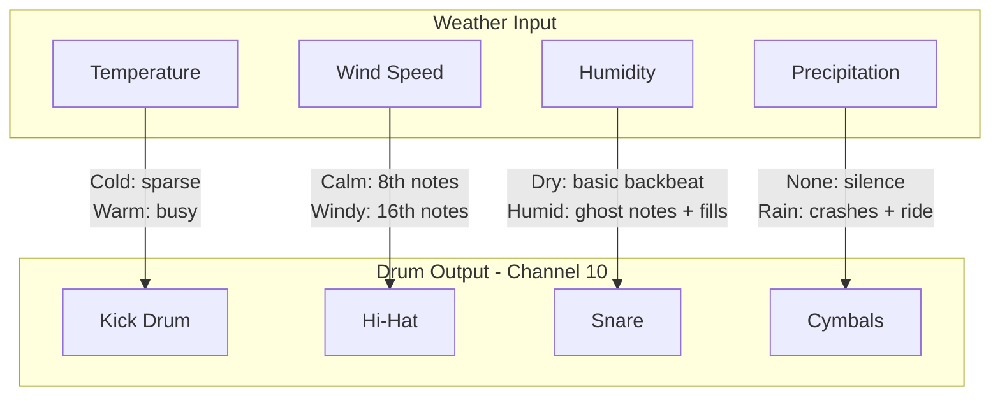
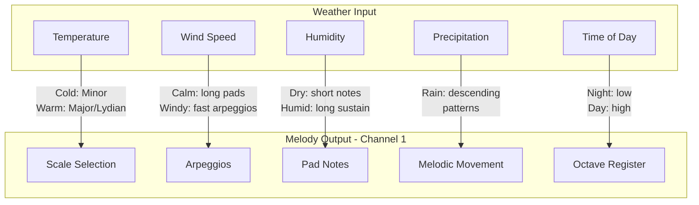
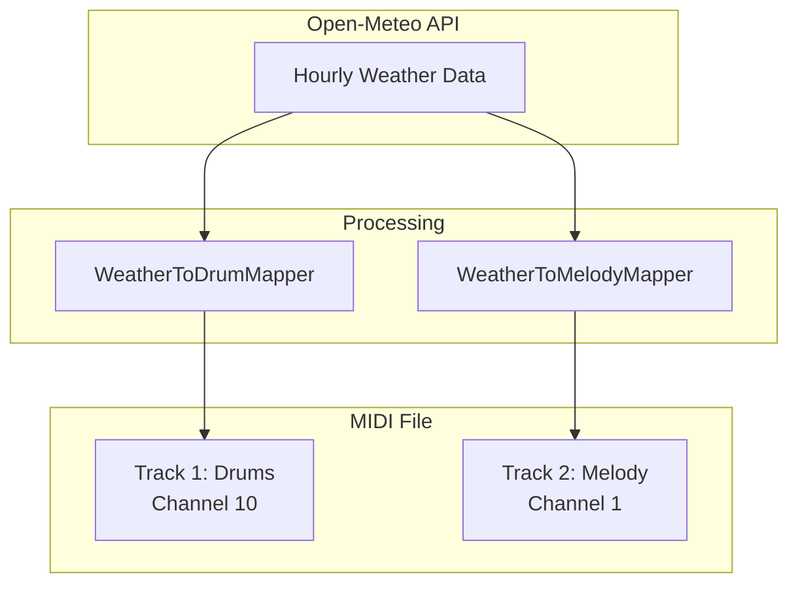
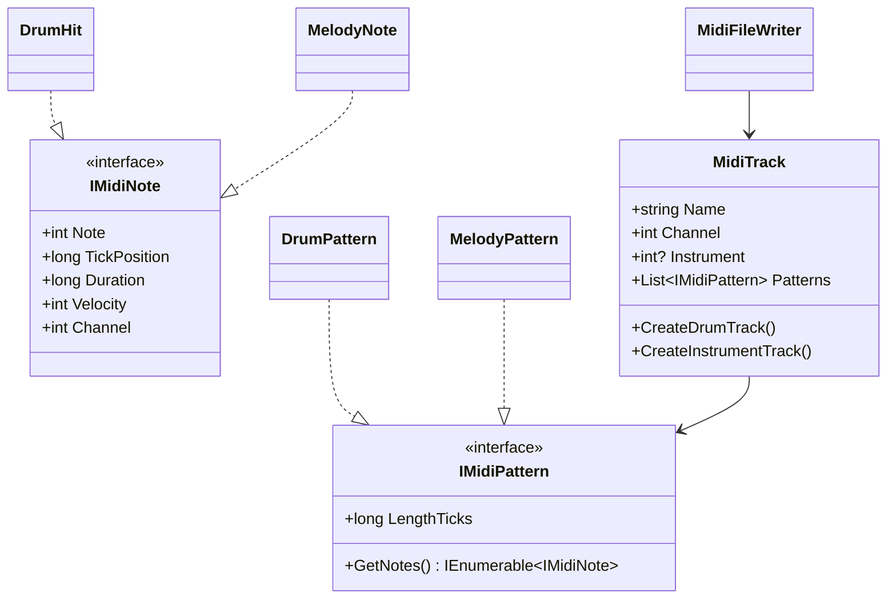

# Weather Drums: Generative Music from the Sky

A C# console application that transforms real-time weather forecasts into MIDI drum loops and ambient melodies.

## The Concept

The weather becomes the composer. Each hour of forecast data generates musical patterns - the atmosphere literally shapes the rhythm and harmony.

## Features

- Fetches real-time weather data from [Open-Meteo API](https://open-meteo.com/) (free, no API key required)
- Generates drum patterns based on temperature, wind, humidity, and precipitation
- Optional ambient melody generation with weather-reactive scales and arpeggios
- Outputs standard MIDI files compatible with any DAW

## Installation

```bash
# Clone or navigate to the project
cd MIDI

# Build the project
dotnet build

# Run
dotnet run -- --help
```

### Dependencies

- .NET 10.0+
- [DryWetMIDI](https://github.com/melanchall/drywetmidi) - MIDI file manipulation library

## Usage

```bash
# Basic usage (drums only, New York weather)
dotnet run

# With location
dotnet run -- -lat 51.5074 -lon -0.1278 -o london_drums.mid

# With ambient melody
dotnet run -- --melody --tempo 80 -o ambient_weather.mid

# Full options
dotnet run -- --melody --instrument 49 --tempo 90 --hours 48 --bars 8 -o weather_music.mid
```

### Command Line Options

| Option | Description | Default |
|--------|-------------|---------|
| `-lat, --latitude` | Location latitude | 40.7128 (New York) |
| `-lon, --longitude` | Location longitude | -74.0060 (New York) |
| `-o, --output` | Output MIDI file path | weather_drums.mid |
| `-t, --tempo` | Tempo in BPM (40-300) | 120 |
| `--hours` | Hours of forecast (1-168) | 24 |
| `--bars` | Bars per hour (1-16) | 4 |
| `-m, --melody` | Enable ambient melody | disabled |
| `--melody-channel` | MIDI channel for melody (0-15) | 0 |
| `--instrument` | GM instrument number (0-127) | 89 (Pad 2) |
| `-h, --help` | Show help | - |

### Common General MIDI Instruments for Ambient

| Number | Instrument |
|--------|------------|
| 49 | String Ensemble |
| 89 | Pad 2 (warm) - default |
| 91 | Pad 4 (choir) |
| 95 | Pad 8 (sweep) |
| 52 | Synth Strings |

---

## How Weather Becomes Music

### Drum Mapping



| Weather | Drum Element | Effect |
|---------|--------------|--------|
| **Temperature** | Kick pattern | Hotter = busier kicks, more energy |
| **Wind Speed** | Hi-hat density | Faster wind = 16th notes vs 8th notes |
| **Humidity** | Snare fills | Muggy = ghost notes and snare fills |
| **Precipitation** | Cymbals | Rain triggers crashes and ride patterns |

### Drum Pattern Detail

| Temperature Range | Kick Pattern |
|-------------------|--------------|
| < 30% | Basic kick (beats 1, 3) |
| 30-60% | + kick on "and" of 2 |
| 60-80% | + kick on "and" of 4 |
| > 80% | + double kick fills |

| Wind Range | Hi-Hat Pattern |
|------------|----------------|
| < 50% | 8th note hi-hats |
| > 50% | 16th note hi-hats |
| > 40% | Open hi-hat on off-beats |

| Humidity Range | Snare Pattern |
|----------------|---------------|
| Base | Snare on 2 and 4 |
| > 40% | + ghost note before 2 |
| > 60% | + ghost note before 4 |
| > 75% | + snare fill every 4 bars |

| Precipitation | Cymbal Pattern |
|---------------|----------------|
| None | No cymbals |
| > 0% | Crash on bar 1 |
| > 30% | Extra crash on bar 3 |
| > 50% | Ride cymbal pattern |

---

### Melody Mapping



| Weather | Musical Element | Effect |
|---------|-----------------|--------|
| **Temperature** | Scale/Mode | Cold = minor keys, warm = major/dreamy modes |
| **Wind Speed** | Arpeggio density | Calm = sustained pads, windy = rippling arpeggios |
| **Humidity** | Note sustain | Humid = legato, flowing notes |
| **Precipitation** | Movement | Rain = descending melodic patterns |
| **Time of Day** | Octave | Night = low register, midday = higher |

### Scale Selection by Temperature

| Temperature | Scale | Character |
|-------------|-------|-----------|
| < 0°C | Minor (Aeolian) | Dark, cold |
| 0-10°C | Dorian | Melancholic |
| 10-20°C | Pentatonic | Neutral, floating |
| 20-30°C | Lydian | Dreamy, warm |
| > 30°C | Major (Ionian) | Bright, open |

### Arpeggio Density by Wind

| Wind Speed | Texture | Note Duration |
|------------|---------|---------------|
| < 5 km/h | Sustained pads | Whole notes |
| 5-15 km/h | Slow arpeggios | Half notes |
| 15-30 km/h | Medium arpeggios | Quarter notes |
| > 30 km/h | Fast arpeggios | 8th notes |

### Time of Day to Octave

| Hour | Period | Octave Shift |
|------|--------|--------------|
| 0-6h | Late Night | -1 octave |
| 6-10h | Morning | Base octave |
| 10-16h | Midday | +1 octave |
| 16-20h | Evening | Base octave |
| 20-24h | Night | -1 octave |

---

## Output Structure



The output MIDI file contains:
- **Track 1:** Tempo + Drums (Channel 10)
- **Track 2:** Ambient melody with program change (Channel 1) - if `--melody` enabled

Import into any DAW, assign your own sounds, layer, and produce.

---

## Creative Possibilities

- Compare weather from different cities
- Use a week's forecast for an evolving 20-minute piece
- Slow tempo (60-80 BPM) for ambient, fast (140+) for electronic
- Layer multiple locations for polyrhythmic textures

*The weather never repeats exactly - neither will your music.*

---

## Project Structure

```
MIDI/
├── WeatherDrums.csproj
├── Program.cs
├── Services/
│   └── WeatherService.cs      # Open-Meteo API client
├── Models/
│   ├── WeatherData.cs         # API response models
│   ├── IMidiPattern.cs        # Generic interfaces and MidiTrack class
│   ├── DrumPattern.cs         # Drum hit and pattern classes
│   └── MelodyPattern.cs       # Melody note, pattern, and scale classes
├── Mapping/
│   ├── WeatherToDrumMapper.cs # Weather → drum pattern logic
│   └── WeatherToMelodyMapper.cs # Weather → melody pattern logic
└── Midi/
    └── MidiFileWriter.cs      # Generic MIDI file output
```

---

## Architecture

The `MidiFileWriter` uses a generic, extensible design based on interfaces. Any pattern type can be written to a MIDI file by implementing `IMidiPattern`.

### Class Diagram



### Usage Example

```csharp
// Build tracks using the generic MidiTrack API
var tracks = new List<MidiTrack>
{
    MidiTrack.CreateDrumTrack("Drums", drumPatterns.Cast<IMidiPattern>()),
    MidiTrack.CreateInstrumentTrack("Melody", channel: 0, instrument: 89, 
        melodyPatterns.Cast<IMidiPattern>()),
    MidiTrack.CreateInstrumentTrack("Bass", channel: 1, instrument: 33, 
        bassPatterns.Cast<IMidiPattern>())
};

var writer = new MidiFileWriter { Tempo = 120 };
writer.WriteToFile("output.mid", tracks.ToArray());
```

### Benefits

- **Extensible:** Add bass, lead, FX patterns without modifying the writer
- **Single API:** One `WriteToFile` method handles any number of tracks
- **Flexible:** Each track specifies its own name, channel, and instrument
- **Type-safe:** Interfaces ensure all patterns provide required MIDI data

### Adding New Pattern Types

To add a new pattern type (e.g., bass lines):

1. Create a note class implementing `IMidiNote`
2. Create a pattern class implementing `IMidiPattern`
3. Create a mapper (e.g., `WeatherToBassMapper`)
4. Add the track using `MidiTrack.CreateInstrumentTrack()`

No changes to `MidiFileWriter` required!

---

## License

MIT

## Contributing

Pull requests welcome! Ideas for new weather-to-music mappings, pattern generators, or output formats are appreciated.
